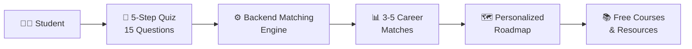
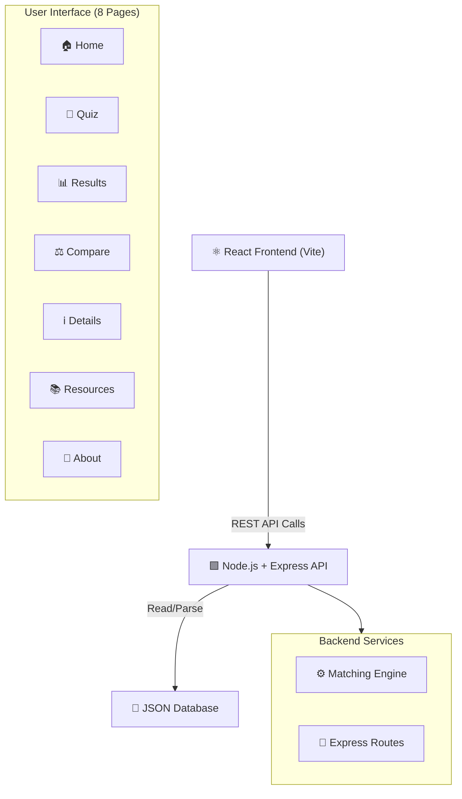
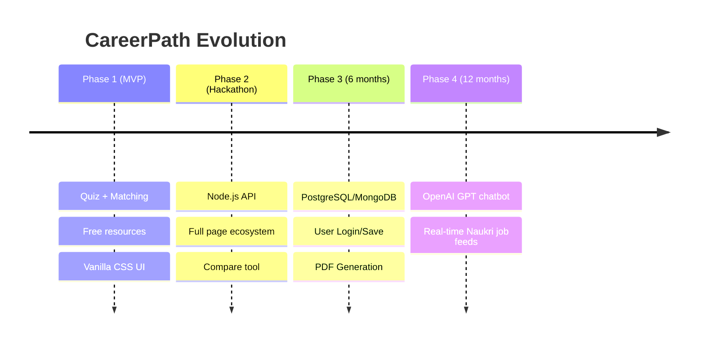

# 🎯 CAREER PATH RECOMMENDER FOR TIER 2/3 STUDENTS

## Innovathon 2026 — Hackathon Presentation

---

| Field | Details |
|---|---|
| **Problem Statement ID** | PS-A05 |
| **Problem Statement Title** | Career Path Recommender for Tier 2/3 Students |
| **Theme** | EdTech / AI Integration |
| **Team ID** | RRGI 100 |
| **Team Name** | CODE TITANS |

---

## 📌 Slide 1 — Title & Introduction

### Career Path Recommender for Tier 2/3 Students

> **"Bridging the career guidance gap for millions of students in smaller cities"**

Students in Tier 2/3 cities of India face a critical problem — **lack of accessible, personalized career counseling**. While metro-city students have counselors, career fairs, and networks, students in smaller cities are forced to make uninformed career decisions, often leading to wrong choices and wasted years.

**CareerPath Recommender** is a data-driven web application that provides:
- 🎯 **Personalized career recommendations** (3–5 matched paths)
- 📚 **Free learning roadmaps** with curated resources
- 💰 **Realistic salary insights** in Indian context (INR)
- 🌐 **Tier 2/3 focused** opportunities and constraints

---

## 📌 Slide 2 — Proposed Solution

### ✅ What We Built

An **AI-based career recommendation system** that takes a student's profile as input and returns the most suitable career paths with actionable next steps.

#### How It Works (User Flow)

#### ✅ Innovation & Uniqueness
- **Constraint-Aware Matching** — Unlike other platforms, we factor in internet speed, budget, and location
- **Full Backend API System** — Dynamically fetches resources, compares careers, and handles logic
- **Vanilla CSS Design System** — Lightweight, ultra-fast UI designed for slower connections
- **100% Free Resources** — Every recommended course is free or has financial aid

---

## 📌 Slide 3 — Technology Architecture

### 🔹 Modern Tech Stack

| Layer | Technology | Purpose |
|-------|-----------|---------|
| **Frontend** | React 18 + Vite | Lightning fast UI |
| **Styling** | Custom Vanilla CSS | No bloat, custom design system, light/dark mode |
| **Backend** | Node.js + Express | RESTful API (6+ endpoints) for dynamic data |
| **Database** | JSON Document Store | Portable, ultra-fast data serving |
| **Matching** | Custom Node.js Engine | Calculates weighted matching scores on the server |

### 🔹 Architecture Diagram

---

## 📌 Slide 4 — Platform Features

### 📊 Deep Dive into Pages

| Feature | Details |
|---------|---------|
| **Dynamic Quiz** | State preserved in session storage; connects to `/api/analyze` |
| **Matching Engine** | Backend runs algorithmic scoring based on multi-factor weights |
| **Compare Careers** | Side-by-side analysis of job demand, salaries, and resources |
| **Resource Hub** | Filterable database of free learning links, courses, and certs |
| **Light/Dark Mode** | Persistent theme toggle using CSS variables |
| **Career Details** | Granular data: Job Roles, Pros/Cons, 6-12-24 month roadmaps |

### 🔹 Working Endpoints

Our backend now serves dynamic data:
- `GET /api/careers` — List of all careers
- `GET /api/careers/:id` — Detailed career profile
- `GET /api/quiz/questions` — Quiz data
- `POST /api/analyze` — The core matching algorithm
- `GET /api/resources` — Aggregated course catalog
- `POST /api/compare` — Side-by-side matching
- `GET /api/stats` — Live platform analytics

---

## 📌 Slide 5 — Feasibility & Impact

### 🌍 Social Impact
- **Democratizes career guidance** — previously only available to metro-city students
- **Reduces information asymmetry** — students make informed decisions
- **Promotes equal opportunities** — highlights remote work and freelance paths
- **Reduces dependency on costly counselors** — free alternative to ₹5,000–10,000/session

### 💰 Economic & Educational Benefits
- **Higher earning potential** through right career choice from the start
- **100% free resources** — freeCodeCamp, Coursera (financial aid), YouTube, Google Certs
- **Realistic timelines** — honest 6–12 month learning paths
- **Bridges gap between education and industry** requirements

### 📊 Technical Viability
- ✅ **Decoupled Architecture** — Frontend and Backend can be scaled independently
- ✅ **Performance** — Removed 200+ heavy NPM packages; app loads instantly
- ✅ **Maintainable** — JSON DB makes adding new careers as simple as editing a file

---

## 📌 Slide 6 — Future Roadmap

---

## 🏆 Summary — Why CareerPath Recommender?

| What | Why It Matters |
|------|---------------|
| **Tier 2/3 Focused** | Other platforms target metros; we focus on smaller cities |
| **Fully Dynamic API** | No hardcoded frontend data. Built like a real production app. |
| **Custom Design System** | Premium, ultra-fast UI without relying on heavy component libraries |
| **Actionable Roadmaps** | Month-by-month plans, not vague advice |
| **Real Salary Data** | Indian market salaries in INR across experience levels |

> **Built with ❤️ by Team CODE TITANS (RRGI 100) for students in Tier 2/3 cities of India**
